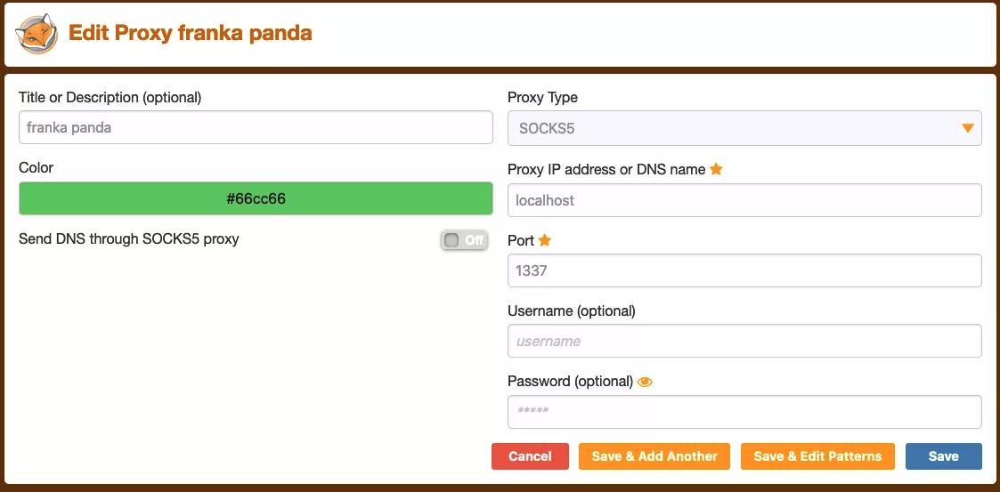

# Prerequisites

## Simulation environments only

For **simulation**, we simply assume a [Conda](https://docs.conda.io/en/latest/) environment with Python 3.8, running on a Linux machine. You may then proceed to [installation](installation.md).

## Franka Panda hardware setup

To control real-time-capable **hardware** (such as the Franka Panda), we highly recommend running the server on a separate machine (e.g. a [NUC](https://www.amazon.com/gp/product/B0842WKBCF/)) with a real-time kernel which is directly connected to the robot.
Your client code should then connect to the server over network and execute any heavy computation (e.g. image processing, planning, GPU usage) to avoid interrupting the real-time control loop on the NUC.

### Setting up the Franka Panda

1. [Mounting plate](https://vention.io/parts/franka-emika-panda-mounting-plate-487) and [clamps](https://www.amazon.com/gp/product/B001KPVFJE/)[^1]

1. Robot stand.
    1. A pricier but nice solution is this [custom-designed](https://vention.io/designs/98080) stand.

1. Networking
    1. Connect NUC to Control using Ethernet
    1. Put GPU-enabled workstation on the same network (could be wireless, since no real-time guarantees for user code).
    1. Optional: You can use [FoxyProxy](https://addons.mozilla.org/en-US/firefox/addon/foxyproxy-standard/) to access Franka Desk from your user machine.
        1. In your `~/.ssh/config`, find the entry you use to `ssh` into your NUC. Add `DynamicForward 1337` to that entry and use that port
        1. Add this to your FoxyProxy settings: 

1. Robot firmware upgrade through Franka World. See Franzi's [Facebook-internal note](https://fb.workplace.com/notes/762408351366858) for details

### Setting up the NUC

_The following guide is written with specific, known-good version numbers to get you up and running as quickly as possible; other versions will also likely work._

1. Install [Ubuntu 18.04.5](https://releases.ubuntu.com/18.04/)

1. The Franka documentation has a [comprehensive guide](https://frankaemika.github.io/docs/installation_linux.html#setting-up-the-real-time-kernel) on installing real-time kernel. Here are some additional pointers[^2]:
    1. Known-good versions: [patch](https://mirrors.edge.kernel.org/pub/linux/kernel/projects/rt/5.4/older/patch-5.4.70-rt40.patch.xz) and [kernel](https://mirrors.edge.kernel.org/pub/linux/kernel/v5.x/linux-5.4.70.tar.xz), which have to be compatible with each other, but not necessarily with the output of `uname -a`. 

    1. You can skip `fakeroot`: `make -j4 deb-pkg`
    
    1. If `make` fails with the error `*** No rule to make target 'debian/canonical-certs.pem', needed by 'certs/x509_certificate_list'`, make sure to set your `/boot/config-*` files with configuration:
        - `CONFIG_SYSTEM_TRUSTED_KEYS = ""`
        - `CONFIG_MODULE_SIG_KEY="certs/signing_key.pem"`
        - `CONFIG_SYSTEM_TRUSTED_KEYRING=y`
    
    1. If you get `kernel signature invalid` error, disable secure boot in your BIOS.

You are now ready to install Polymetis.

---

[^1]: Credit to Vikash Kumar for documenting the hardware installation process.

[^2]: Credit to Akshara Rai for going through the process and debugging these quirks.